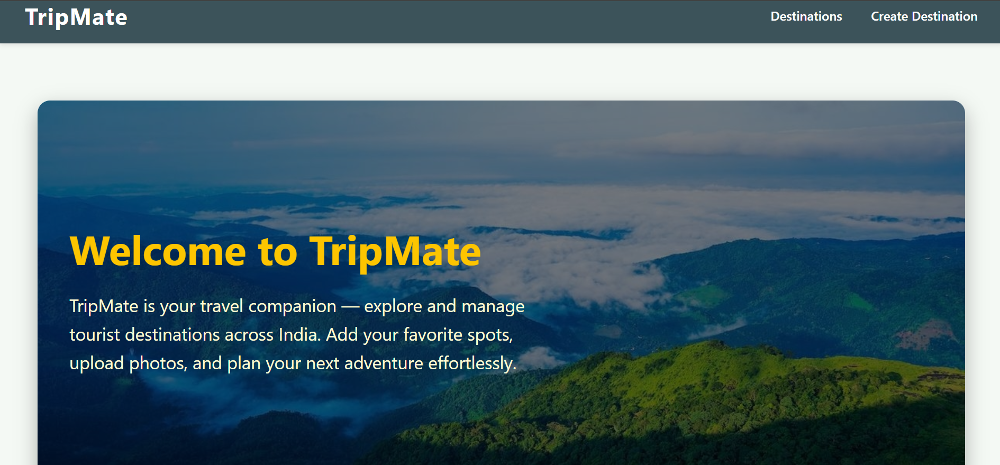

# 🧭 TripMate - TouristDestination 🌍✨

Welcome to **TripMate** — a Django-powered web application for managing tourist destinations, planning trips, and making travel easy and organized.

---

## 📸 Project Preview

---

## ✨ Features

✅ Browse tourist destinations with rich details  
✅ Interactive itinerary planner  
✅ User authentication & admin management  
✅ Responsive design with Bootstrap  
✅ Django Admin for easy backend management  
✅ Modular, easy-to-maintain code structure

---

## 🛠️ Tech Stack

- **Backend:** Django (Python)
- **Frontend:** HTML, CSS, Bootstrap
- **Database:** MySQL
- **Admin:** Django Admin Panel

---

